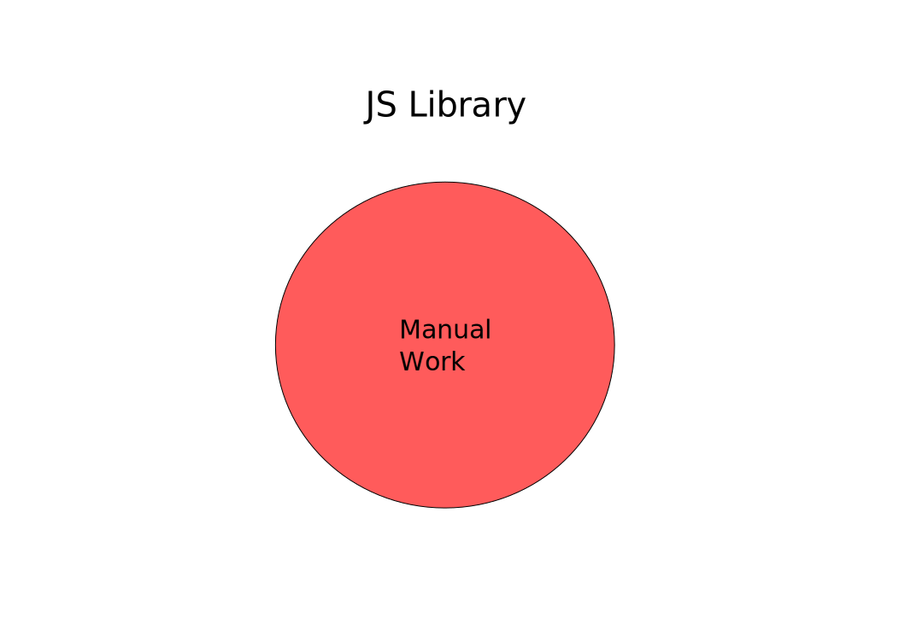

# External JavaScript
## Not handled by Google Closure Compiler

!SLIDE

## JavaScript Library

    @@@javascript
    var foo = {};
    foo.bar = function(greeting) {
      return greeting + " friend";
    }

## Calling library in ClojureScript

    @@@clojure
    (.bar js/foo "hello")
!SLIDE

## Everything works fine in

- Development
- Testing
- QA
- Production Builds

!SLIDE

## Error in production application

## Complied JavaScript

    @@@javascript
    foo.w("hello");

What happened to `foo.bar`?

!SLIDE

## Google Closure Compiler Renaming

Optimizations `:advanced`

`foo`.`bar`(`"hello"`)

.down_arrow ⬇

Google Closure Compiler

.down_arrow ⬇

`foo`.`w`(`"hello"`)

!SLIDE

# Inform Google Closure about external names
## An "externs" file

    @@@javascript
    var foo = {};
    /*
     * @param {string}
     * @return {string}
     * @nosideeffects
     */
    foo.bar = function(greeting) {};

!SLIDE

# Externs more than preventing renaming
## Help Google Closure advanced compilation

- Type information
- Indicate side effect free functions

!SLIDE

Optimizations `:advanced`

`foo`.`bar`(`"hello"`)

.down_arrow ⬇

Google Closure Compiler ⬅ `foo`.`bar`

.down_arrow ⬇

`foo`.`bar`(`"hello"`)

!SLIDE

# All that is needed is to richly annotate the api's of the projects JavaScript libraries

!SLIDE

!SLIDE

!SLIDE

!SLIDE

!SLIDE

# Caught in the Pit of Despair
## Only most popular libraries are readily usable

!SLIDE

# We can escape the Pit Of Despair

- ClojureScript Externs inference
- `cljs-oops` library
!SLIDE

# Externs Inference
## Added in ClojureScript `1.9.456`

!SLIDE

## Compiler Option
### Turns on Externs Inference and writes an externs file `inferred_externs.js`

    @@@clojure
    :infer-externs true

## Infer Waring Flag
### Turns on inference warnings

    @@@clojure
    (set! *warn-on-infer* true)

!SLIDE

# Three types of inference warnings

- Use of an unknown JavaScript type
- Using Base JavaScript Object
- Calling an Unknown method or property  on a known extern

!SLIDE

    @@@clojure
    (defn cloudy [outside]
      (.getClouds outside))

### "Cannot infer target type for ..."

`Unknown Object Type` ⮕ `outside`

`Weather` ⮕ `outside`

!SLIDE

## Type Hint `outside` with `js/Weather`

    @@@clojure
    (defn cloudy [^js/Weather outside]
      (.getClouds outside))

!SLIDE

    @@@clojure
    (defn cloudy [^js/Weather outside]
      (let [clouds (.getClouds outside)]
        (.getType clouds)))

### "Adding extern to Object for ..."

`outside.getClouds()` ⮕ `Object`

`outside.getClouds()` ⮕ `Clouds`

!SLIDE

## Wrap `getClouds` function in ClojureScript

    @@@clojure
    (defn ^js/Clouds get-clouds [^js/Weather outside]
      (.getClouds outside))

    (defn cloudy [outside]
      (let [clouds (get-clouds outside)]
        (.getType clouds)))

!SLIDE

## Add return type to `getClouds`
## Add `Clouds` externs to `inferred_externs.js`

    @@@javascript
    /*
     *  @return {Clouds}
     */
    Weather.prototype.getClouds;

    var Clouds;
    Clouds.prototype.getType = function() {};

!SLIDE

    @@@clojure
    (defn cloudy [^js/Weather outside]
      (let [clouds (.getClouds outside)]
        (.frog clouds)))

### "Cannot resolve property ..."

### `Clouds.prototype.frog` does not exist in externs

!SLIDE

## Change ` (.frog clouds)` to `(.getType clouds)`

## Add `frog` to `inferred_externs.js`

    @@@javascript
    Clouds.prototype.frog = function() {};

!SLIDE

# `cljs-oops`
# Sidestep externs entirely using string names

!SLIDE

## Use String Names via `goog.object/get` or `aget`
## Advanced compilation does not rename String Names

    @@@clojure
    (ns my.app
     (:require [goog.object :as gobj]))

    (defn cloudy [outside]
      (.call (gobj/get outside "getClouds") outside))

!SLIDE

# `cljs-oops` provides macros for automation

!SLIDE

# `oget`
## Retrieve JavaScript Object properties

    @@@clojure
    (def home #js {"floor" #js {"living-room" "500 sqft"}})
    (oget home "floor" "living-room")
    ;; => "500 sqft"

!SLIDE

# `oset!`
## Set JavaScript Object properties

    @@@clojure
    (def home #js {"floor" #js {"living-room" "500 sqft"}})
    (oset! home  "floor" "living-room" "300 sqft")
    ;; => #js {"floor" #js {"living-room" "300 sqft"}}

!SLIDE

# `ocall`
## Call JavaScript methods with fixed arguments

    @@@clojure
    (def car #js {"ispy" (fn [desc item] (str "I see a " desc " " item))})
    (ocall car "ispy" "red" "barn")
    ;; => "I see a red barn"

!SLIDE

# `oapply`
## Call JavaScript methods with variadic arguments

    @@@clojure
    (def bill #js {"total" (fn [& items] (reduce + items))})
    (oapply bill "total" [1 2 3])
    ;; => 6

!SLIDE

# `cljs-oops` not just automation

## extensive validation during development
## emits optimized code during advanced compilation

!SLIDE

# Navigating JavaScript Objects
## Access Modifiers

- `?` soft access, returns `nil` for non existent key
    - Change `key` to `?key`
- `!` punching, creates key when it does not exist
    - Change `key` to `!key`

!SLIDE

# `?` soft access
## Like `get-in`

        @@@clojure
        (def home #js {"house" #js {"bedroom" #js {:color "red"}}})
        (oget home "house" "?livingroom" "color")
        ;; => nil

&nbsp;

        @@@clojure
        (def home {:house {:bedroom {:color "red"}}})
        (get-in home [:house :living-room])
        ;; => nil
!SLIDE

# `!` punching
## Like `assoc-in`

        @@@clojure
        (def home #js {})
        (oset! home "!house" "!livingroom" "!color" "green")
        ;; => #js {"house" #js {"livingroom" #js {"color" "green"}}}

&nbsp;

        @@@clojure
        (def home {})
        (assoc-in home [:house :livingroom :color] "green")
        ;; => {:house {:livingroom {:color "green"}}}

!SLIDE

## Quickly use External JavaScript Libraries with

- ClojureScript externs inference
- `cljs-oops`

!SLIDE

# Only prevent renaming
## Provide no information to Google Closure
## Hampers advanced compilation

!SLIDE

# Prefer CLJSJS library or Externs file

- Easier to use
- Maximize advanced compilation effectiveness

 

# When neither exist look at

- ClojureScript externs inference
- `cljs-oops`
