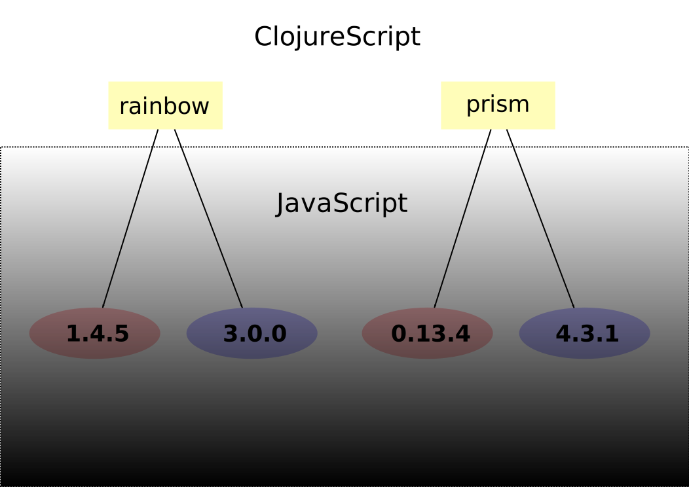

# Compiling Node Modules
## Miracle Pill

!SLIDE

## Google Closure Compiler can compile node modules

- Facebook React and React DOM 53k
- Google Closure React and React DOM 32k

!SLIDE

# New compiler option `:npm-deps`

    @@@clojure
    {:npm-deps {:react     "15.4.2"
                :react-dom "15.4.2"}}

!SLIDE

# `react` and `react-dom` are now just libararies

    @@@clojure
    (ns my.app
      (:require [react :as React]
                [react-dom :as ReactDOM]))

    (def app (React/createElement "h1" nil "Hello World!"))
    (ReactDOM/render app (.getElementById js/document "app"))

!SLIDE

# React and ReactDom are namespaces

    @@@clojure
    (React/createElement "hi" nil "Hello World")

## CLJSJS Style

    @@@clojure
    (.createElement js/React "hi" nil "Hello World")

!SLIDE

# Now for the caveats, addendum's, and hoop jumping

!SLIDE

# ClojureScript does not manage JavaScript dependency graph

!SLIDE

!SLIDE

## Application development is the big winner

- `npm` or `yarn` can manage JavaScript dependencies
- Minimal code size with advanced compilation

!SLIDE

# `module-deps` JavaScript library needed

- `npm install --save-dev module-deps`
- `yarn add --dev module-deps`

!SLIDE

## Externs for Node needed

- JavaScript uses Node to compile JavaScript
- `react` uses `process.env.NODE_ENV`
- Available at https://github.com/dcodeIO/node.js-closure-compiler-externs

!SLIDE

# CLJSJS libraries for externs
## Tells Closure about dynamic (meta programmed) names

    @@@clojure
    [cljsjs/react "15.4.2-2"]
    [cljsjs/react-dom "15.4.2-2"]

!SLIDE

# Making the miracle pill from scratch
## Useful for debugging purposes

!SLIDE

## To create a miracle pill from scratch first you must create the universe.

!SLIDE

# Install `react` and `react-dom`

## NPM
- `npm install --save react@15.4.2`
- `npm install --save react-dom@15.4.2`

## YARN
- `yarn add react@15.4.2`
- `yarn add  react-dom@15.4.2`

!SLIDE

# Create the recipe for the miracle pill

!SLIDE

# Setup dependencies and exports

    @@@@javascript
    var React = require("react");
    var ReactDOMServer = require("react-dom");

    module.exports = {
      React: React,
      ReactDOM: ReactDOM
    };

!SLIDE

# Collect the ingredients for the miracle pill

!SLIDE

Pass in file as a `foreign-lib` to `cljs.closure/node-inputs`

    @@@clojure
    (require '[clojure.java.io :as io])
    (require 'cljs.closure)

    (def root-js-deps
      {:file (.getAbsolutePath (io/file "path/to/npm_deps.js"))
       :provides ["libs.npm-deps"]
       :module-type :commonjs})

    (def node-libs
      (into [entry] (cljs.closure/node-inputs [root-js-deps])))

!SLIDE

# Finally ready to make the miracle pill

!SLIDE

## Pass `cljs.closure/node-inputs` result to `:foreign-libs`

    @@@clojure
    (require 'cljs.build.api)

    (cljs.build.api/build "src"
      {:optimizations :advanced
       :output-to "out/app.js"
       :foreign-libs  node-libs})

!SLIDE

# Same result as `:npm-deps`
## `React` and `ReactDom` are in `lib.npm-deps`

    @@@clojure
    (ns my.app
      (:require [lib.npm-deps :as npm-deps]))

    (def app (npm-deps/React.createElement "h1" nil "Hello World!"))
    (npm-deps/ReactDOM.render app (.getElementById js/document "app"))

!SLIDE

# Still very alpha
## It's not just ClojureScript working on this

!SLIDE

# Major players are integrating Google Closure

## React - Fiber Build
https://github.com/facebook/react/issues/7925

## Angular - Offline Template Compilation
https://github.com/angular/angular/issues/8550

## Typescript -  tsickle
https://github.com/angular/tsickle
